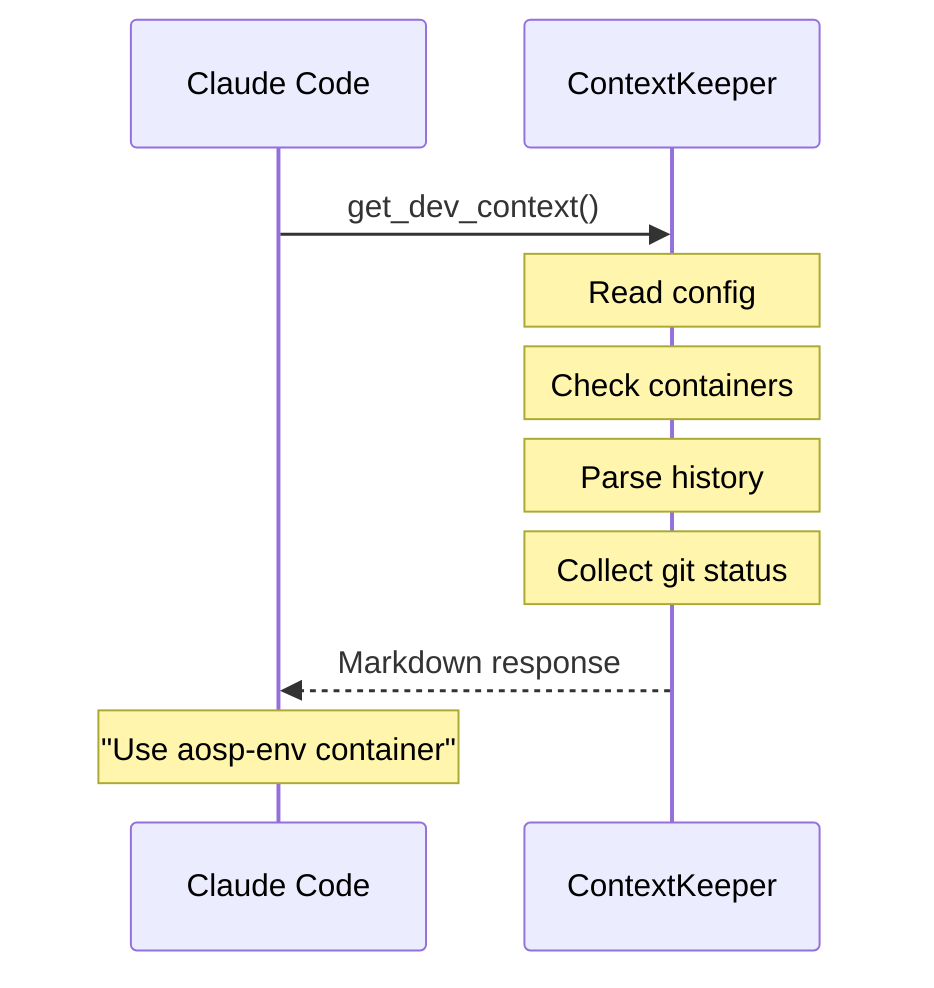

# ContextKeeper

**AI-Native Development Context Engine** - Helps AI agents remember your build environment after context compression.

> **Note:** ContextKeeper is designed for **Claude Code**. It uses MCP (Model Context Protocol) and Claude Code Hooks for full functionality. Basic features (context output via CLI) work with other tools, but command history tracking and auto-recovery require Claude Code.

## Target Users

ContextKeeper is designed for developers working with **complex build environments**:

- **AOSP / Android Platform** - Multiple lunch targets, containerized builds
- **ROS / ROS2** - Workspace configurations, launch files
- **Yocto / Embedded Linux** - BitBake targets, layers
- **Multi-container development** - Docker/Podman based workflows

If your project requires explaining build setup repeatedly to AI assistants, ContextKeeper can help.

## The Problem

When working with AI coding assistants (Claude Code, Cursor, etc.) on complex projects:

- AI forgets your build targets after context compression
- You repeatedly explain which container to use
- Environment variables and lunch targets get lost
- "Run this in the container" instructions disappear

## The Solution

ContextKeeper provides a **dynamic, queryable summary** of your development environment via MCP (Model Context Protocol).

Unlike static documentation, ContextKeeper collects **current state** at query time:
- Which containers are actually running right now
- What `lunch` target was used in the last session
- Build targets and their configurations

## Features

| Collector | Type | Description |
|-----------|------|-------------|
| **BuildScript** | Static | Parses config files to extract build targets |
| **Container** | Dynamic | Detects running Podman/Docker containers |
| **History** | Dynamic | Tracks relevant commands via Claude Code Hooks |
| **Git** | Dynamic | Multi-repository status (branch, changes, last commit) |
| **ADB/Fastboot** | Dynamic | Connected Android devices |
| **WorkState** | Persistent | Saves/restores work state across compressions |

### Context Compression Recovery

ContextKeeper provides **hierarchical output levels** to minimize token usage after context compression:

| Level | Tokens | Content |
|-------|--------|---------|
| `minimal` | ~200 | Hint + task + working files + dirty repos |
| `normal` | ~400 | + containers + AI hints |
| `full` | ~1000 | Complete information including all repos |

## Quick Start

### 1. Install

**Option A: One-liner install (recommended)**

```bash
curl -sSL https://raw.githubusercontent.com/sat0sh-dev/context-keeper/main/scripts/install-binary.sh | bash
```

**Option B: Build from source**

```bash
git clone https://github.com/sat0sh-dev/context-keeper
cd context-keeper
cargo build --release
```

### 2. Initialize your project

```bash
cd /your/project
context-keeper init
```

### 3. Configure your project (manual alternative)

Create `contextkeeper.toml` in your project root:

```toml
[project]
name = "My AOSP Project"
type = "aosp"

[scripts]
entry_point = "scripts/build.sh"
config_dir = "scripts/config"
config_pattern = "*.conf"

[containers]
runtime = "podman"  # or "docker"

[hints]
default = "Build commands must be executed inside the container."

[history]
enabled = true
patterns = [
    "lunch\\s+\\S+",
    "source.*envsetup",
    "export\\s+\\w+="
]
max_entries = 20
```

### 4. Test locally

```bash
cd /your/project
/path/to/context-keeper --context
```

### 5. Setup with Claude Code

**Option A: Run install script**

```bash
./install.sh
```

**Option B: Manual setup**

1. Add MCP server to `~/.claude.json`:

```json
{
  "projects": {
    "/your/project": {
      "mcpServers": {
        "context-keeper": {
          "type": "stdio",
          "command": "/path/to/context-keeper/target/release/context-keeper",
          "args": [],
          "env": {}
        }
      }
    }
  }
}
```

2. (Optional) Enable hooks for command history and context recovery in `~/.claude/settings.json`:

```json
{
  "hooks": {
    "PostToolUse": [
      {
        "matcher": "Bash",
        "hooks": [
          {"type": "command", "command": "/path/to/context-keeper/hooks/log-commands.sh"}
        ]
      },
      {
        "matcher": "TodoWrite",
        "hooks": [
          {"type": "command", "command": "/path/to/context-keeper/hooks/save-todos.sh"}
        ]
      },
      {
        "matcher": "Edit",
        "hooks": [
          {"type": "command", "command": "/path/to/context-keeper/hooks/track-files.sh"}
        ]
      },
      {
        "matcher": "Write",
        "hooks": [
          {"type": "command", "command": "/path/to/context-keeper/hooks/track-files.sh"}
        ]
      }
    ]
  }
}
```

**Hook descriptions:**
- `log-commands.sh`: Captures relevant Bash commands (lunch targets, environment setup)
- `save-todos.sh`: Saves current todos for automatic recovery after context compression
- `track-files.sh`: Tracks recently edited files for context recovery

3. Restart Claude Code and verify with `/mcp`

## AOSP Setup Guide

### Directory Structure

```
your-aosp-project/
├── contextkeeper.toml          # ContextKeeper config
├── manifest/
│   └── scripts/
│       ├── aosp.sh             # Entry point script
│       └── config/
│           ├── emu.conf        # Emulator target config
│           └── device.conf     # Device target config
```

### Config File Format (`*.conf`)

```bash
# emu.conf - Android Emulator target
TARGET_NAME="emu"
TARGET_DESCRIPTION="AAOS Emulator (Car)"
CONTAINER_NAME="aosp-build-env"
LUNCH_TARGET="sdk_car_dev-trunk_staging-userdebug"
CAN_EMULATOR=true
CAN_FLASH=false
```

### contextkeeper.toml for AOSP

```toml
[project]
name = "AOSP Custom Build"
type = "aosp"

[scripts]
entry_point = "manifest/scripts/aosp.sh"
config_dir = "manifest/scripts/config"
config_pattern = "*.conf"

[containers]
runtime = "podman"

[hints]
default = "Build commands must run inside the container. Use './manifest/scripts/aosp.sh' as entry point."

[history]
enabled = true
patterns = [
    "lunch\\s+\\S+",           # lunch target selection
    "source.*envsetup",        # environment setup
    "m\\s+\\S+",               # make shortcut
    "mm\\b",                   # make module
    "mma\\b",                  # make module all
    "podman\\s+exec.*lunch",   # lunch inside container
]
max_entries = 20
```

### Example Output

```markdown
# Development Context (ContextKeeper)

## Project
- **Name:** AOSP Custom Build
- **Type:** aosp

## AI Hints (Important)
> Build commands must run inside the container.

## Available Build Targets

| Target | Description | Container | Lunch Target |
|--------|-------------|-----------|--------------|
| emu | AAOS Emulator | aosp-build-env | sdk_car_dev-... |
| device | Pixel 7a | aosp-build-env | aosp_lynx-... |

## Active Containers
- **aosp-build-env** (podman): Up 5 days

## Recent Relevant Commands
| Time | Command |
|------|---------|
| 2024-01-15T10:30:00Z | `lunch sdk_car_dev-trunk_staging-userdebug` |
```

## Configuration Reference

### `contextkeeper.toml`

| Section | Field | Description |
|---------|-------|-------------|
| `[project]` | `name` | Project display name |
| | `type` | Project type (aosp, ros, yocto, custom) |
| `[scripts]` | `entry_point` | Main build script path |
| | `config_dir` | Directory containing target configs |
| | `config_pattern` | Glob pattern for config files |
| `[containers]` | `runtime` | Container runtime (podman/docker) |
| `[hints]` | `default` | Important instructions for AI |
| `[history]` | `enabled` | Enable command history (true/false) |
| | `patterns` | Regex patterns to match relevant commands |
| | `max_entries` | Maximum history entries to display |

## MCP Tools

| Tool | Description |
|------|-------------|
| `get_dev_context(level)` | Returns development context. Level: `minimal`, `normal` (default), `full` |
| `save_work_state(...)` | Save current work state for recovery after compression |

### get_dev_context

```
get_dev_context()           # Normal level (default)
get_dev_context("minimal")  # After compression (~200 tokens)
get_dev_context("full")     # Complete information (~1000 tokens)
```

### save_work_state

```
save_work_state(
  task_summary: "Implementing rate limiter",
  working_files: ["auth_hook.cpp", "main.rs"],  # Optional, auto-detected if omitted
  notes: "Token bucket implementation in progress",
  todos: '[{"content": "Add tests", "status": "pending"}]'  # JSON string
)
```

## CLI Usage

```bash
# Initialize a new project (interactive wizard)
context-keeper init

# Output context as Markdown (for testing)
context-keeper --context          # Normal level
context-keeper --context minimal  # Minimal level
context-keeper --context full     # Full level

# Save work state (for PreCompact hook)
context-keeper --save-state "Current task description"

# Run as MCP server (default, used by Claude Code)
context-keeper
```

### Init Wizard

The `init` command provides an interactive setup wizard:

```
$ context-keeper init

🔧 ContextKeeper Setup Wizard

Project name [my-project]:
Project type (detected: aosp) [aosp]:
Container runtime (detected: podman) [podman]:
Build script entry point (optional): scripts/build.sh
Config directory (optional): scripts/config
AI hint for this project: Build commands must run inside container

✅ Created contextkeeper.toml
```

**Auto-detection:**
- **AOSP**: Detects `build/envsetup.sh`
- **ROS/ROS2**: Detects `package.xml` or colcon workspace
- **Yocto**: Detects `meta-*` directories or `poky/`
- **Container runtime**: Checks for podman/docker availability

## Context Compression Recovery Setup

To automatically save work state before context compression:

### 1. Install hooks

```bash
mkdir -p ~/.contextkeeper/hooks
cp hooks/pre-compact-save.sh ~/.contextkeeper/hooks/
chmod +x ~/.contextkeeper/hooks/pre-compact-save.sh
```

### 2. Configure Claude Code hooks

Add to `~/.claude/settings.json`:

```json
{
  "hooks": {
    "PreCompact": [
      {
        "matcher": "*",
        "hooks": [
          {
            "type": "command",
            "command": "bash ~/.contextkeeper/hooks/pre-compact-save.sh"
          }
        ]
      }
    ],
    "PostToolUse": [
      {
        "matcher": "Bash",
        "hooks": [
          {
            "type": "command",
            "command": "/path/to/context-keeper/hooks/log-commands.sh"
          }
        ]
      }
    ]
  }
}
```

### 3. Recovery flow

```
Context compression imminent
        ↓
PreCompact hook → save work state (git diff files)
        ↓
Compression occurs
        ↓
Claude calls get_dev_context("minimal")
        ↓
Work state recovered (~200 tokens)
```

## How It Works



## Roadmap

- [x] BuildScript Collector
- [x] Container Collector
- [x] History Collector (via Claude Code Hooks)
- [x] Official Rust MCP SDK (rmcp)
- [x] Git branch/status collector (multi-repo support)
- [x] ADB/Fastboot device detection
- [x] Work state save/restore for compression recovery
- [x] Hierarchical output levels (minimal/normal/full)
- [x] PreCompact hook integration
- [x] `context-keeper init` wizard
- [ ] Guardrails (pending - observing if hints are sufficient)
- [ ] ROS/ROS2 workspace detection
- [ ] Yocto/BitBake support

## License

MIT

## Contributing

Contributions welcome! Please open an issue first to discuss changes.
